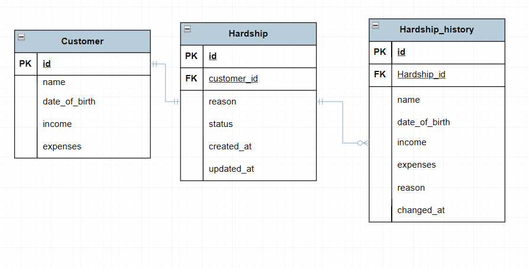
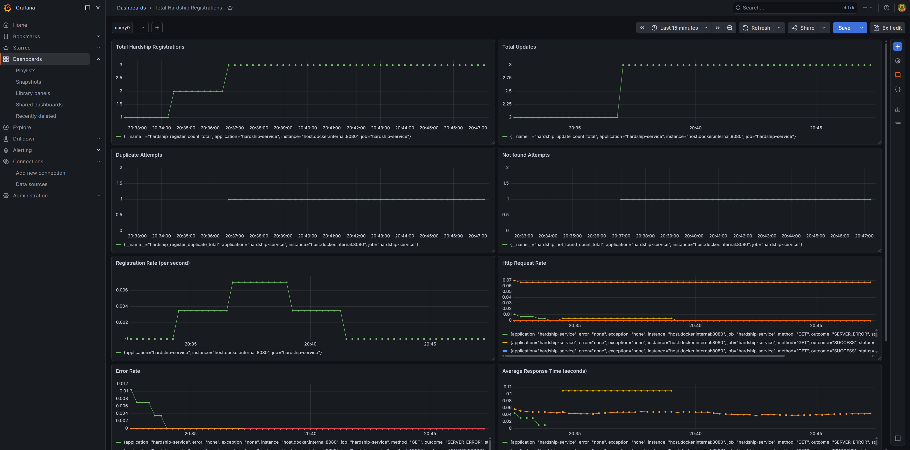

# Hardship Application API

A Spring Boot REST API for managing customer hardship applications. The system allows customers to submit, update, and
track hardship applications with full audit history.

---

## Table of Contents

- [Overview](#overview)
- [Tech Stack](#tech-stack)
- [Project Structure](#project-structure)
- [Database Schema](#database-schema)
- [API Endpoints](#api-endpoints)
- [Request & Response](#request--response)
- [Error Handling](#error-handling)
- [Getting Started](#getting-started)
- [Running Tests](#running-tests)
- [Configuration](#configuration)
- [Metrics & Monitoring](#metrics--monitoring)

---

## Overview

The Hardship Application API provides:

- Submit a new hardship application
- Update an existing hardship application
- Retrieve a list of all hardship applications
- Full audit history tracking on every create and update

---

## Tech Stack

| Technology        | Version | Purpose                         |
|-------------------|---------|---------------------------------|
| Java              | 21      | Language                        |
| Spring Boot       | 3.5.x   | Framework                       |
| Spring Data JPA   | 3.5.x   | ORM / Database access           |
| MySQL             | 8.0     | Production database             |
| H2                | Latest  | In-memory database for testing  |
| MapStruct         | 1.5.5   | DTO / Entity mapping            |
| Lombok            | 1.18.x  | Boilerplate reduction           |
| springdoc-openapi | 2.8.6   | Swagger / OpenAPI documentation |
| JUnit 5           | Latest  | Unit testing                    |
| Mockito           | Latest  | Mocking framework               |
| Micrometer        | Latest  | Metrics collection              |
| Prometheus        | Latest  | Metrics storage                 |
| Grafana           | Latest  | Metrics visualisation           |

---

## Project Structure

```
src/
├── main/
│   ├── java/com/assignment/hardship/
│   │   ├── HardshipApplication.java         # Main entry point
│   │   ├── config/
│   │   │   ├── AppConfig.java        # JPA auditing config & OpenAPI config
│   │   ├── controller/
│   │   │   └── HardshipController.java       # REST controller
│   │   ├── dto/
│   │   │   ├── request/
│   │   │   │   └── HardshipRequest.java      # Request DTO
│   │   │   └── response/
│   │   │       ├── HardshipResponse.java     # Single record response
│   │   │       └── HardshipSummaryResponse.java # List response
│   │   ├── entity/
│   │   │   ├── Customer.java                 # Customer entity
│   │   │   ├── Hardship.java                 # Hardship application entity
│   │   │   └── HardshipHistory.java          # Audit history entity
│   │   ├── exception/
│   │   │   ├── ErrorCode.java                # Error code enum
│   │   │   ├── ErrorResponse.java            # Error response DTO
│   │   │   ├── ValidationErrorResponse.java  # Validation error response DTO
│   │   │   ├── GlobalExceptionHandler.java   # Global exception handler
│   │   │   └── HardShipException.java        # Custom exception
│   │   ├── mapper/
│   │   │   └── HardshipMapper.java           # MapStruct mapper
│   │   ├── repository/
│   │   │   ├── CustomerRepository.java
│   │   │   ├── HardshipRepository.java
│   │   │   └── HardshipHistoryRepository.java
│   │   └── service/
│   │       ├── HardshipService.java          # Service interface
│   │       └── impl/
│   │           └── HardshipServiceImpl.java  # Service implementation
│   └── resources/
│       ├── application.yml                   # Shared config
│       └── application-local.yml             # Local MySQL config (gitignored)
├── test/
│   ├── java/com/assignment/hardship/
│   │   ├── controller/
│   │   │   └── HardshipControllerTest.java   # Controller layer tests
│   │   ├── integration/
│   │   │   └── HardshipIntegrationTest.java  # Integration tests
│   │   └── service/
│   │       └── HardshipServiceTest.java      # Service layer tests
│   └── resources/
│       └── application.yml                   # H2 test config
└── docs/
    └── diagrams/
        └── db-diagram.md                     # ERD diagram
```

---

## Database Schema

###



### Tables

```
  CUSTOMER {
    bigint id PK
    string name
    date date_of_birth
    decimal income
    decimal expenses
  }

  HARDSHIP_APPLICATION {
    bigint id PK
    bigint customer_id FK
    string reason
    string status
    timestamp created_at
    timestamp updated_at
  }

  HARDSHIP_HISTORY {
    bigint id PK
    bigint hardship_application_id FK
    string name
    date date_of_birth
    decimal income
    decimal expenses
    string reason
    timestamp changed_at
    string changed_by
  }
```

### Relationships

- `CUSTOMER` ↔ `HARDSHIP_APPLICATION` — One-to-One: one customer has exactly one hardship application
- `HARDSHIP_APPLICATION` ↔ `HARDSHIP_HISTORY` — One-to-Many: every create and update saves a history snapshot

---

## API Endpoints

Base URL: `/api/v1/hardship`

| Method | Endpoint                | Description                             |
|--------|-------------------------|-----------------------------------------|
| `POST` | `/api/v1/hardship`      | Submit a new hardship application       |
| `PUT`  | `/api/v1/hardship/{id}` | Update an existing hardship application |
| `GET`  | `/api/v1/hardship`      | Get all hardship applications           |

---

## Request & Response

### Submit hardship — `POST /api/v1/hardship`

**Request body:**

```json
{
  "name": "John Doe",
  "dateOfBirth": "1990-05-20",
  "income": 75000.00,
  "expenses": 30000.00,
  "reason": "Lost job due to redundancy"
}
```

| Field         | Type              | Required | Description               |
|---------------|-------------------|----------|---------------------------|
| `name`        | String            | ✅ Yes    | Customer full name        |
| `dateOfBirth` | Date `yyyy-MM-dd` | ✅ Yes    | Must be in the past       |
| `income`      | Decimal           | ✅ Yes    | Annual income, min 0.01   |
| `expenses`    | Decimal           | ✅ Yes    | Annual expenses, min 0.01 |
| `reason`      | String            | ❌ No     | Reason for hardship       |

**Response `201 Created`:**

```json
{
  "hardshipId": 1,
  "customerId": 1,
  "name": "John Doe",
  "dateOfBirth": "1990-05-20",
  "income": 75000.00,
  "expenses": 30000.00,
  "reason": "Lost job due to redundancy",
  "status": "PENDING",
  "createdAt": "2026-04-20T10:00:00",
  "updatedAt": "2026-04-20T10:00:00"
}
```

---

### Update hardship — `PUT /api/v1/hardship/{id}`

**Request body:** same as POST request body

**Response `200 OK`:** same as POST response body

---

### Get all hardships — `GET /api/v1/hardship`

**Response `200 OK`:**

```json
[
  {
    "hardshipId": 1,
    "name": "John Doe",
    "reason": "Lost job due to redundancy",
    "status": "PENDING",
    "createdAt": "2026-04-20T10:00:00"
  }
]
```

Returns empty array `[]` when no records exist.

---

## Error Handling

All errors return a consistent error response format.

### Business error response (404, 409, 500)

```json
{
  "code": "ERR_H001",
  "message": "Hardship application not found",
  "status": 404,
  "timestamp": "2026-04-20T10:00:00"
}
```

### Validation error response (400)

```json
{
  "code": "ERR_400",
  "message": "Validation failed",
  "status": 400,
  "timestamp": "2026-04-20T10:00:00",
  "fieldErrors": {
    "name": "name can't be blank",
    "income": "income can't be null"
  }
}
```

### Error codes

| Code                      | HTTP Status | Description                                           |
|---------------------------|-------------|-------------------------------------------------------|
| `BAD_REQUEST`             | 400         | Validation failed                                     |
| `HARDSHIP_NOT_FOUND`      | 404         | Hardship application not found                        |
| `HARDSHIP_ALREADY_EXISTS` | 409         | Hardship application already exists for this customer |
| `INTERNAL_SERVICE_ERROR`  | 500         | Internal server error                                 |

---

## Getting Started

### Prerequisites

- Java 21
- Maven 3.8+
- MySQL 8.0

### 1. Clone the repository

```bash
git clone https://github.com/yourusername/hardship.git
cd hardship
```

### 2. Create the database

```sql
CREATE DATABASE hardship_db
    CHARACTER SET utf8mb4
    COLLATE utf8mb4_unicode_ci;
```

### 3. Create `application-local.yml`

Create `src/main/resources/application-local.yml` (this file is gitignored):

```yaml
spring:
  datasource:
    url: jdbc:mysql://localhost:3306/hardship_db
    username: root
    password: your_password
    driver-class-name: com.mysql.cj.jdbc.Driver
  jpa:
    open-in-view: false # suppress warning
```

### 4. Run the application

```bash
./mvnw spring-boot:run
```

Or on Windows:

```bash
mvnw.cmd spring-boot:run
```

### 5. Access Swagger UI

```
http://localhost:8080/swagger-ui/index.html
```

---

## Running Tests

### Run all tests

```bash
./mvnw test
```

### Run specific test class

```bash
./mvnw test -Dtest=HardshipServiceTest
./mvnw test -Dtest=HardshipControllerTest
./mvnw test -Dtest=HardshipIntegrationTest
```

### Test coverage

| Test class                | Type                              | What it tests                                |
|---------------------------|-----------------------------------|----------------------------------------------|
| `HardshipServiceTest`     | Unit test (Mockito)               | Business logic, exception throwing           |
| `HardshipControllerTest`  | Controller test (WebMvcTest)      | HTTP status codes, response body, validation |
| `HardshipIntegrationTest` | Integration test (SpringBootTest) | Full end-to-end flow with H2 database        |

---

## Configuration

### `application.yml` (shared)

```yaml
spring:
  profiles:
    active: local
  jpa:
    hibernate:
      ddl-auto: update
    properties:
      hibernate:
        format_sql: true
    show-sql: true
    open-in-view: false

springdoc:
  api-docs:
    path: /api-docs
  swagger-ui:
    path: /swagger-ui.html
```

### `src/test/resources/application.yml` (test)

```yaml
spring:
  datasource:
    url: jdbc:h2:mem:testdb
    driver-class-name: org.h2.Driver
    username: sa
    password:
  jpa:
    hibernate:
      ddl-auto: create-drop
    properties:
      hibernate:
        dialect: org.hibernate.dialect.H2Dialect
```

---

## Application Status Flow

```
PENDING → APPROVED
PENDING → REJECTED
```

| Status     | Description                   |
|------------|-------------------------------|
| `PENDING`  | Default status on submission  |
| `APPROVED` | Application has been approved |
| `REJECTED` | Application has been rejected |

---

## Metrics & Monitoring

The app uses **Spring Boot Actuator + Micrometer + Prometheus + Grafana** for metrics and monitoring.

---

### Stack overview

```
Spring Boot App  →  exposes metrics at /actuator/prometheus
Prometheus       →  scrapes and stores metrics every 15s
Grafana          →  visualises metrics as dashboards
```

---

### Actuator endpoints

| Endpoint                   | Description                |
|----------------------------|----------------------------|
| `/actuator/health`         | App health status          |
| `/actuator/prometheus`     | Raw metrics for Prometheus |
| `/actuator/metrics`        | All available metric names |
| `/actuator/metrics/{name}` | Specific metric value      |

---

### Custom business metrics

| Metric                              | Description                     |
|-------------------------------------|---------------------------------|
| `hardship_register_count_total`     | Total hardship registrations    |
| `hardship_register_duplicate_total` | Duplicate registration attempts |
| `hardship_update_count_total`       | Total hardship updates          |
| `hardship_not_found_count_total`    | Not found errors                |
| `hardship_register_timer_seconds`   | Registration response time      |

---

### Auto-collected metrics (free)

| Metric                         | Description                             |
|--------------------------------|-----------------------------------------|
| `http_server_requests_seconds` | Request count and duration per endpoint |
| `jvm_memory_used_bytes`        | JVM heap/non-heap usage                 |
| `jvm_gc_pause_seconds`         | Garbage collection pauses               |
| `hikaricp_connections`         | DB connection pool usage                |
| `process_cpu_usage`            | CPU usage                               |

---

### Start Prometheus & Grafana

Requires **Docker Desktop** installed and running.

```bash
# Start from project root
docker compose up -d

# Verify containers are running
docker compose ps
```

Expected output:

```
NAME         STATUS     PORTS
grafana      running    0.0.0.0:3000->3000/tcp
prometheus   running    0.0.0.0:9090->9090/tcp
```

---

### Access monitoring tools

| Tool       | URL                     | Credentials   |
|------------|-------------------------|---------------|
| Prometheus | `http://localhost:9090` | None          |
| Grafana    | `http://localhost:3000` | admin / admin |

---

### Configure Grafana

1. Open `http://localhost:3000`
2. Login with `admin / admin`
3. Go to **Configuration → Data Sources → Add → Prometheus**
4. Set URL to `http://prometheus:9090`
5. Click **Save & Test** — should show green confirmation
6. Go to **Dashboards → Import → Enter ID: `12900`**
7. Select Prometheus data source → **Import**

---

### Grafana dashboard panels

| Panel               | Query                                                                                       | Visualization |
|---------------------|---------------------------------------------------------------------------------------------|---------------|
| Total Registrations | `hardship_register_count_total`                                                             | Stat          |
| Total Updates       | `hardship_update_count_total`                                                               | Stat          |
| Duplicate Attempts  | `hardship_register_duplicate_total`                                                         | Stat          |
| Not Found Errors    | `hardship_notfound_count_total`                                                             | Stat          |
| Registration Rate   | `rate(hardship_register_count_total[5m])`                                                   | Time series   |
| HTTP Request Rate   | `rate(http_server_requests_seconds_count{job="hardship-service"}[5m])`                      | Time series   |
| Error Rate          | `rate(http_server_requests_seconds_count{job="hardship-service",status=~"4..\|5.."}[5m])`   | Time series   |
| Avg Response Time   | `rate(http_server_requests_seconds_sum[5m]) / rate(http_server_requests_seconds_count[5m])` | Time series   |
| JVM Heap Memory     | `jvm_memory_used_bytes{area="heap"}`                                                        | Time series   |



---

### `docker-compose.yml`

```yaml
services:

  prometheus:
    image: prom/prometheus:latest
    container_name: prometheus
    ports:
      - "9090:9090"
    volumes:
      - ./prometheus.yml:/etc/prometheus/prometheus.yml
    networks:
      - monitoring

  grafana:
    image: grafana/grafana:latest
    container_name: grafana
    ports:
      - "3000:3000"
    environment:
      - GF_SECURITY_ADMIN_PASSWORD=admin
    networks:
      - monitoring

networks:
  monitoring:
    driver: bridge
```

### `prometheus.yml`

```yaml
global:
  scrape_interval: 15s

scrape_configs:
  - job_name: 'hardship-service'
    metrics_path: '/actuator/prometheus'
    static_configs:
      - targets: [ 'host.docker.internal:8080' ]
```

---

## Notes for Developers

- `application-local.yml` is gitignored — never commit database credentials
- Always run tests before pushing — `./mvnw test`
- Audit history is saved on every **create** and **update** — do not delete history records
- `reason` field is optional — null is valid
- All dates use ISO 8601 format `yyyy-MM-dd`
- All timestamps use ISO 8601 format `yyyy-MM-ddTHH:mm:ss`
- Metrics are exposed at `/actuator/prometheus` — Docker must be running for Grafana to display data
- Custom metrics increment on every API call — call the API at least once before checking Grafana
